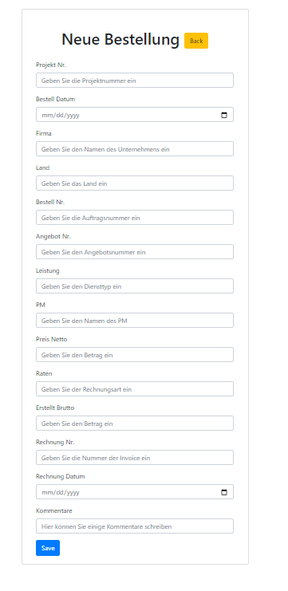
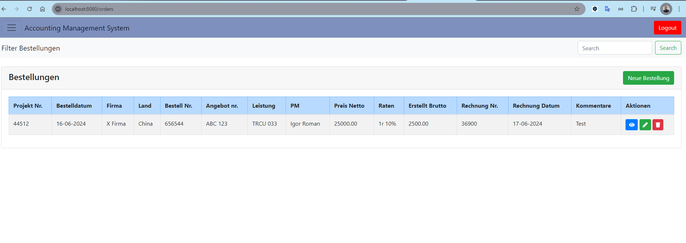

# Accounting Management System

## Overview

This Spring Boot project is designed to help manage and coordinate invoices, purchases, and new
projects for a company. The system provides functionalities to add new projects, record invoice details, 
and track companies that have outstanding payments.

## Features

* <b> Orders Management</b>: Add and manage new projects with detailed information and payment 
  conditions.

  
* <b> Invoice Management </b>: Record and track invoice details for each project.
  
* <b> Debitors Management </b>: Maintain a list of companies that have not yet paid their invoices.

## Sections
### Orders

This section allows the company to enter details of new projects. When a new project is initiated, all relevant information, including payment conditions, can be recorded.

### Invoices

In this section, users can write and manage invoice information related to various projects. This helps keep track of all financial transactions and ensures that records are maintained accurately.

### Debitors

The Debitors section lists companies that have outstanding invoices. This helps the company track unpaid invoices and manage follow-ups for payment collection.

## Getting Started

To get started with the project, follow these steps:

1. Clone the repository: 
git clone https://github.com/yourusername/project-management-system.git
2. Navigate to the project directory:  cd project-management-system
3. Build the project: ./mvnw clean install
4. Run the application: ./mvnw spring-boot:run

## Configuration

Ensure you have the correct database configuration in your application.properties file. Below is an example configuration for PostgreSQL:

spring.datasource.url=jdbc:postgresql://localhost:5432/my_db
spring.datasource.username=postgres
spring.datasource.password=yourpassword

spring.jpa.properties.hibernate.dialect=org.hibernate.dialect.PostgreSQLDialect
spring.jpa.hibernate.ddl-auto=none
spring.jpa.hibernate.show-sql=true

## Technologies Used

* <b>Spring Boot</b> :  For creating the RESTful web services.
* <b>PostgreSQL</b> : As the database for storing project, invoice, and debtor information.
* <b>Hibernate</b> : For ORM (Object-Relational Mapping).
* <b>Maven</b> : For project management and build.